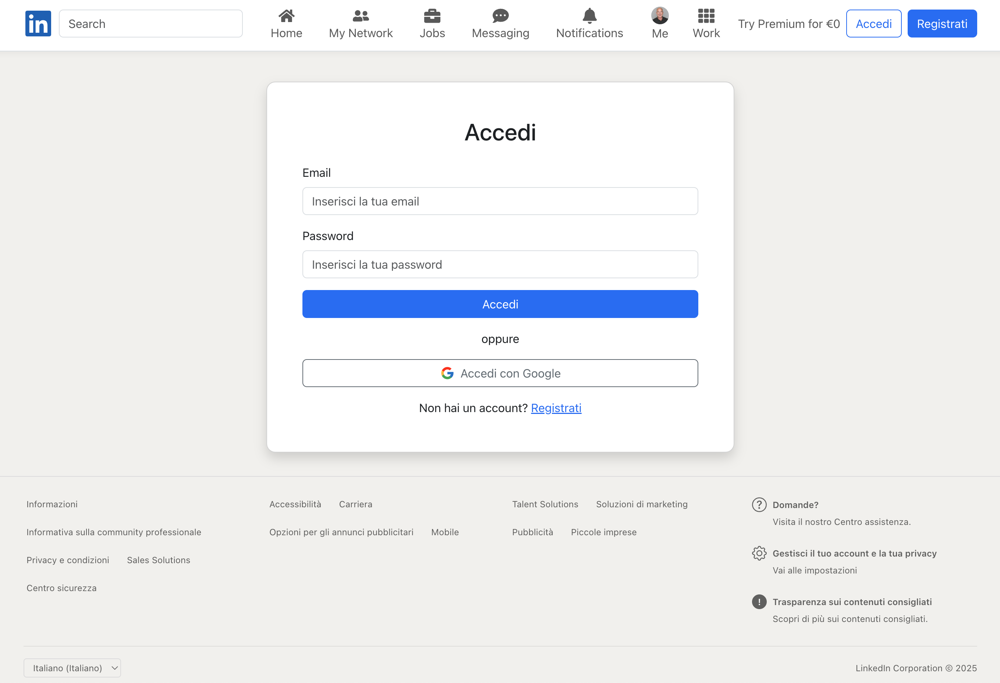

# 🔗 Clone LinkedIn - Progetto Full Stack

Un clone completo di LinkedIn realizzato con React e Node.js, che replica le principali funzionalità della piattaforma professionale più utilizzata al mondo.

**👉 [Visualizza la versione live del progetto](https://6-1-build-week-ch-1-front-end.vercel.app)**


## 📋 Descrizione del Progetto

Questo progetto full-stack è strutturato in due parti principali:
- **Frontend**: Sviluppato con React, offre un'interfaccia utente moderna e reattiva
- **Backend**: API RESTful costruita con Express.js e MongoDB

### 🎯 Funzionalità Principali
- Autenticazione utente (locale e Google OAuth)
- Gestione profilo professionale
- Timeline delle esperienze lavorative
- Sezione formazione ed istruzione
- Ricerca altri profili
- Sistema di following

## 🛠️ Tecnologie Utilizzate

### Frontend
- React con Vite
- Bootstrap 5 e React Bootstrap
- React Router per la navigazione
- Context API per la gestione dello stato
- Axios per le chiamate API

### Backend
- Node.js con Express
- MongoDB con Mongoose
- JWT per l'autenticazione
- Multer per upload file
- Passport.js per OAuth

## 📁 Struttura del Progetto

Il progetto è organizzato come una monorepo con la seguente struttura:

```
linkedin-clone/
├── Front-end/                # Applicazione React
│   ├── src/
│   │   ├── components/      # Componenti React riutilizzabili
│   │   ├── context/        # Context API per lo stato globale
│   │   ├── pages/          # Pagine dell'applicazione
│   │   └── config/         # Configurazioni (axios, env, etc.)
│   └── public/             # Asset statici
│
├── Back-end/                # Server Node.js
│   ├── controllers/        # Logic dei controller
│   ├── models/            # Modelli MongoDB/Mongoose
│   ├── routes/            # Definizione delle route API
│   ├── middleware/        # Middleware personalizzati
│   └── img/              # Immagini e media
│
└── img/                    # Immagini condivise del progetto
```

### 📦 Componenti Principali

- **Frontend**:
  - `HeroComponent`: Profilo utente e informazioni principali
  - `ExperienceComponent`: Timeline esperienze lavorative
  - `EducationComponent`: Sezione formazione
  - `ActivityComponent`: Feed attività utente
  - `Mynav`: Barra di navigazione principale

- **Backend**:
  - `authController`: Gestione autenticazione
  - `profileController`: Gestione profili utente
  - `experienceRoutes`: API esperienze lavorative
  - `profileRoutes`: API profili utente

## 💻 Come Iniziare

```bash
# Clona il repository
git clone https://github.com/henry8913/6.1_Build-Week-CH1.git

1. Installa le dipendenze in entrambe le cartelle:

    ```bash
    cd Front-end && npm install
    cd ../Back-end && npm install
    ```

2. In ciascuna cartella (`Front-end` e `Back-end`), crea il file `.env` copiando da `.env.example` e inserisci le variabili richieste.

3. Avvia il backend:

    ```bash
    cd Back-end
    npm run dev
    ```

4. In un nuovo terminale, avvia il frontend:

    ```bash
    cd Front-end
    npm run dev
    ```
```
## 📸 Screenshot



## 🔄 Gestione del Monorepo

Il progetto utilizza una struttura monorepo con due script bash per semplificare la gestione.

### 🚀 Per maggiori dettagli, puoi visitare le repository individuali:
- [Repository Frontend](https://github.com/henry8913/6.1_Build-Week-CH1_Front-end.git)
- [Repository Backend](https://github.com/henry8913/6.1_Build-Week-CH1_Back-end.git)

## 👥 Team di Sviluppo
- [henry8913](https://github.com/henry8913)
- [Alina-Galben](https://github.com/Alina-Galben)
- [AriannaDeSabata](https://github.com/AriannaDeSabata)
- [Giovanni-code-dev](https://github.com/Giovanni-code-dev)
- [IvanFucchi](https://github.com/IvanFucchi)

## 🤝 Come Contribuire

Siamo entusiasti di accogliere contributi dalla community! Se desideri partecipare al miglioramento di questo progetto, ecco come puoi farlo:

1. **Crea un Branch**: Sviluppa le tue modifiche in un branch dedicato
   ```bash
   git checkout -b feature/nome-feature
   ```

2. **Sviluppa**: Implementa le tue modifiche seguendo le best practice del progetto

3. **Testa**: Assicurati che il codice funzioni correttamente e non introduca problemi

4. **Documenta**: Aggiorna la documentazione se necessario

5. **Crea una Pull Request**: Invia le tue modifiche attraverso una PR con una chiara descrizione delle modifiche

### 📋 Linee Guida per i Contributi
- Mantieni uno stile di codice coerente
- Scrivi test per le nuove funzionalità
- Documenta le modifiche significative
- Segui i principi SOLID e le best practice React/Node.js
- Mantieni le modifiche focused e di dimensioni gestibili

## 👤 Autori

Progetto demo creato da [Team 3](https://github.com/henry8913/6.1_Build-Week-CH1/graphs/contributors) per scopi didattici.

## 📝 Licenza
Questo progetto è distribuito con licenza MIT.
